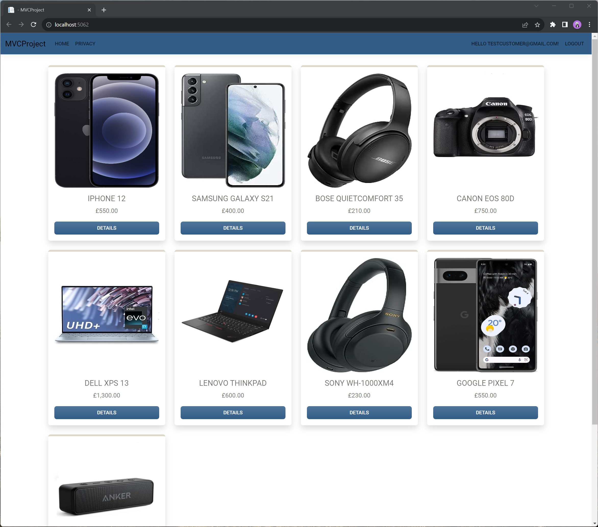
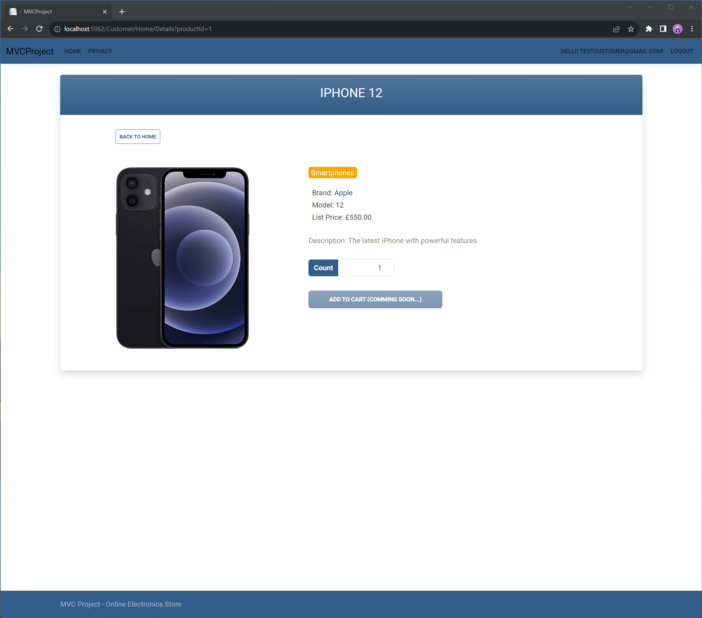
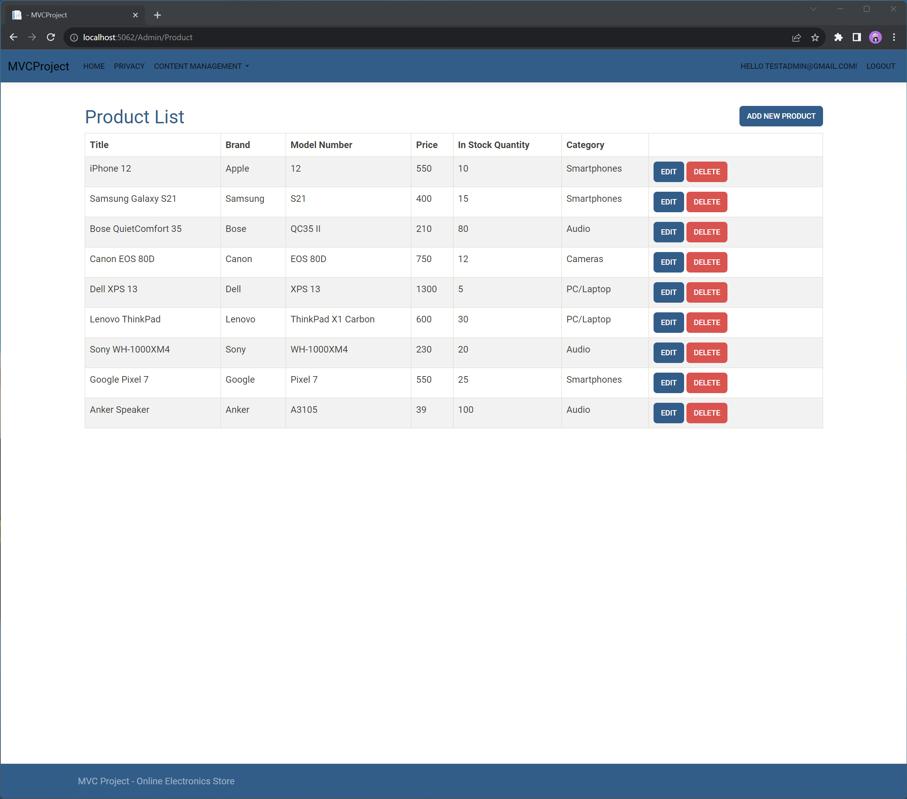

# Online Electronics Store

This is a web-based electronics store application developed using C#, .NET Core, Entity Framework Core, and ASP.NET MVC. It provides a user-friendly interface for customers to browse and purchase electronics products, as well as admin functionalities for managing product listings and categories.

## Features

- **Product Listings**: The home page displays a list of electronics products with detailed information, including category, brand, model, price, and in-stock quantity.

- **Role-Based Access Control**:
   - **Customer Role**: Customers can browse the product listings, view detailed information about electronics products, and explore the catalog.
   - **Admin Role**: Admin users have additional privileges, including CRUD operations for product categories and products. Admins can manage and update product listings and categories.

- **User-Friendly Interface**: The application is designed with a user-friendly and responsive interface to enhance the shopping experience.

- **Toastr and Alerts**: Toastr is integrated for displaying alerts and notifications to users.

## Technologies Used

- C#
- .NET Core (Framework)
- Entity Framework Core (ORM)
- ASP.NET MVC (Web Framework)
- Razor Pages (for Identity - register/login)
- Toastr (Alerts)
- N-tier Architecture
- Repository Pattern

## Prerequisites

- [.NET Core SDK](https://dotnet.microsoft.com/download/dotnet-core) installed.
- A code editor
- A database server (e.g., SQL Server, SQLite)

## Installation

1. Clone the repository: https://github.com/Harinder05/MVCStoreProject.git
2. Install Dependencies: Install the required NuGet packages that are in the in the project's `.csproj` file.
3. Database Setup: Configure your database connection in the `appsettings.json` file and apply the database migrations.
4. Run the Application: Build and start the application.

## Screenshots

Here are some screenshots of the Online Electronics Store:

*The home page displaying featured products.*

*Product details page with additional information.*

*Admin panel for managing products.*

Feel free to explore more screenshots in the `screenshots` folder.
